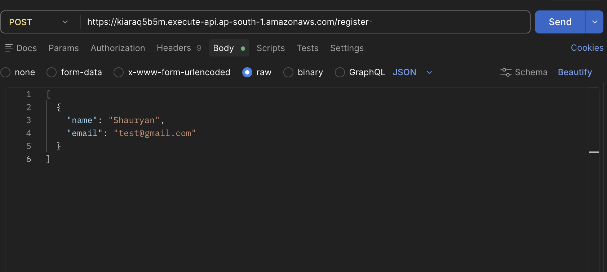
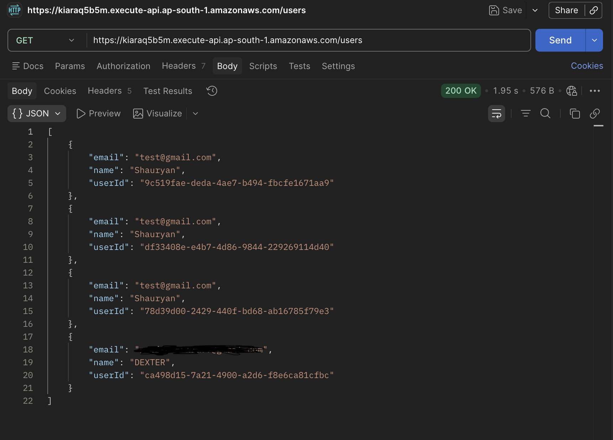
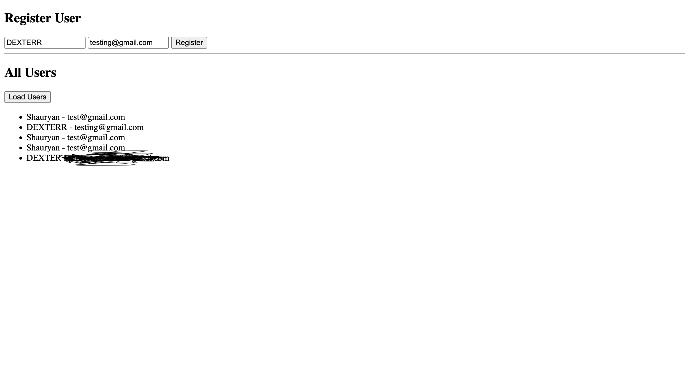

# AWS-User_API
---

## 📌 Overview
This project demonstrates a full-stack serverless application built using AWS and Terraform.

It includes:
- User registration API
- Fetch users API
- Frontend dashboard

---

## 🧩 Services Used
- AWS Lambda
- Amazon API Gateway
- Amazon DynamoDB
- AWS IAM
- Terraform

---

## ⚙️ Architecture
Frontend → API Gateway → Lambda → DynamoDB

---

## 🧪 Features
- Register users
- View all users
- Infrastructure as Code using Terraform

---

## ⚠️ Challenges Faced
- Understanding Terraform syntax and structure  
- Handling IAM roles and permissions  
- Fixing CORS issues between frontend and API  
- Debugging Lambda errors using CloudWatch  

---

## 📚 Key Learnings
- Infrastructure as Code (Terraform)  
- Building serverless APIs  
- Integrating frontend with cloud backend  
- Debugging cloud-based applications  

---

## 📸 Screenshots

### 🔹 POST API (Register User)

### 🔹 GET API (Fetch Users)

### 🔹 Frontend Dashboard

